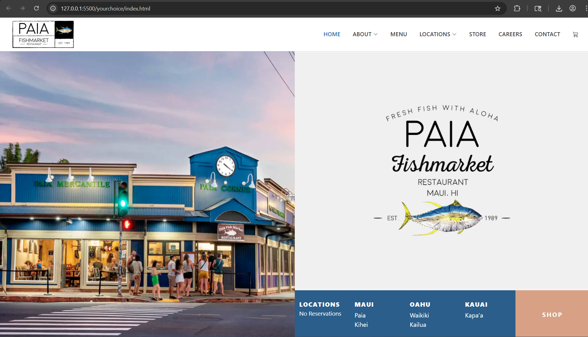

There is a lot of difficulty that comes with UI Frameworks.  Simple HTML is rather easy to pick up on, with CSS having many more rules that make websites and their development much more complex.  On top of that, UI Frameworks add another whole level of complexity for developers to master.

Before starting this class, I have used TailwindCSS for some of my projects, which is similar to Bootstrap in the way that it allows for inline styling and speeds up development.  Instead of having the requirement of a complex stylesheet with all of your complex style rules, styles can be changed inline in the HTML file.  Bootstrap does the same thing, but it also allows developers to reuse common styles and elements rather than having to write them out themselves.

Bootstrap plays a similar role that TailwindCSS does, but it also has some different features that developers can use to speed up their workflow.

## Usage of Bootstrap

Bootstrap contains many standard elements that have been premade and ready for developers to put directly in their code.  Many elements, such as their navbar, whould be tedious to make without Bootstrap every time, so it is very useful to have reusable code ready for use in any project.  

Bootstrap's ability to have inline styles, meaning that CSS can be written within HTML and interpreted into CSS styles through Bootstrap.  The styles that are written inline take precedence over any stylesheet styles, meaning that even if an element is styled through a class, any styles that are written inline will take precedence over that.  

In this class, it is very useful to have the ability to reuse their prewritten components and templates so that projects can be completed faster and with ease.  It is difficult and tedious to have to rewrite every simple element that you create, which is why it is very helpful to have a framework such as Bootstrap.

The framework is simple enough for beginners to pick up and get started with, but there is so much that the framwork can do that I believe that I still have not yet mastered Bootstrap and there are still many more things to learn.  In programming there will always be new technologies and ways of doing things, but it is difficult to memorize all of them, so it is beneficial to use frameworks like Bootstrap and look up documentation for what we need for our code.

## Your Choice Assignment

For the Your Choice assignment, we had to create a rendition of an already existing website using Bootstrap.  It seemed like everyone was doing this with websites for local businesses, so I did the same.  I chose Paia Fish Market, which is a restaurant I enjoy and has locations across multiple islands, with the original in Paia, Maui.

In the above image, you can see that the website I created looks very similar to the one here at [Paia Fish Market](https://paiafishmarket.com).  Using Bootstrap elements such as their navbar, I was able to create a very similar looking edition of the front page purely with HTML with Bootstrap elements.

The top navbar is a great example of an element that can be reused with Bootstrap, as it follows a similar template every time.  Bootstrap offers these elements to us so that we do not have to write them ourselves every time, and allow us to use those elements and create websites such as this one.

I tried to make my rendition as close as possible using elements that look similar to the actual website, but I couldn't get a perfect copy of it because I had to guess what the colors used on the pages were, as well as what the fonts were for my website.  Furthermore, the spacing may be a little off because of the difference in font sizes, but I think that using Bootstrap elements made this process much easier and helped create a better rendition of the website.

## Will I be using Bootstrap more after using it here?

Yes.  Definitely.  Bootstrap makes styling and creating elements much easier, as CSS can be very complex and impossible to memorize every possible way to style an element.  For future projects inside and outside of this class, I definitely will continue to use Bootstrap because of its ease of use and it helps speed up workflow with its premade templates, elements, and styles.
