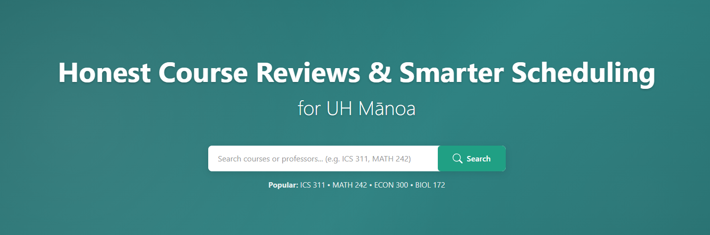

Before learning about design patterns, I main thought about software as something designed with similar structure, just using different tools to get the job done.  In a way I wasn't fully wrong.  Design patterns helped me realize that there is another layer behind the structure we see. 

A design pattern is a reusable solution to a common software design problem. It is a set of rules and a proven way of organizing code so that the project stays understandable as it grows. In my final project, this matters because the app is developed in a way that makes it more than just a static website. Our project, Manoa CourseWise has course information, reviews, users, search features, and database interactions. Design patterns are the structure that holds it all together.

The main design pattern that appea

## Research on Design Patterns

I did my own further research design patterns on what design patterns exist, and I started to understand them as ways to recognize structure in software. At first, I thought design patterns sounded like abstract vocabulary that was used to describe things such as CSS styles and other choices on styles. However, once I started connecting them to my own final project, they became easier to understand. However, I noticed they are used in a different context.

Design Patterns are useful because they give names to design choices that developers are already making.  These design patterns are best used to help explain why those choices make sense. They also make it easier to communicate with other developers because the pattern gives everyone a shared way to describe the structure of the application.

## Design Patterns Reflected in the Project

In my project, the main design pattern we used is Model-View-Controller, or MVC. The model is represented by our data layer, including the course, review, and user information stored in our PostgreSQL database through Prisma. The view is the part of the project that users interact with, such as the homepage, course listings, review displays, search interface, and forms. The controller shows up in the logic that connects user actions to the correct result, such as loading course data, submitting reviews, or routing users to the correct page. 

We also use the Front Controller pattern through the way our app handles routing. This routing system receives requests and directs users to the correct part of the application. The Singleton design pattern also applies because of our use of Prisma and the Vercel-deployed PostgreSQL database.  Since the app relies on one central database setup rather than creating disconnected database connections throughout the project.

## Importance to Developers

These concepts are important to developers because they help keep software structured as it is built.  A small project may still work even with disorganized code, but once an application has users, forms, authentication, database calls, and multiple pages, structure becomes much more important. 

Design patterns make a project easier to understand, debug, expand, and explain to other people. For our project, these concepts matter because the goal of the app is to help students make better decisions about the courses they take at UH Manoa.  If the app grows in the future to include things such as more reviews, professor pages, or advanced filtering, the project needs an organized foundation.  In this case, MVC, Front Controller, and Singleton are the concepts that make the app maintainable and realistic as a software project.  Design Patterns are important to developers to ensure that their projects keep the organization and structure they need, just like what is seen in our project.

Note: Generative AI (ChatGPT 5.5) was used in the process of design pattern research and how it applies to the project, and helped create ideas and content for an initial draft of the essay, and restructured its content and writing to reflect my thoughts for the final draft.
