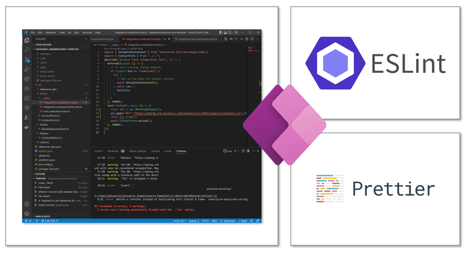

Coding standards seem like just another set of rules, but in a field like software engineering and programming where everything has its own ruleset, coding standards provide a way for us to give our code structure and readability.

Writing code is almost never a one and done thing, it takes multiple iterations of editing from oneself as well as others, which requires a way for people to have a certain way they write code.  Having a set coding standard allows for this structure and readability, and I believe it is important for collaboration and longevity of code.

ESLint allows for a standard to be set in how code is written, and in this class using it with Typescript, there are some clear rules that need to be followed.

## Usage of ESLint

ESLint is a great tool for coding, especially in Typescript, as it provides insight into issues in code as well as maintaining style standards.  Having the ESLint extension in VS Code makes it so much easier to detect these issues in code early, so that you don't spend hours trying to fix issues with code.

ESLint finds issues with code in ways such as potential bugs as well as style and coding standards issues, and highlights those to developers.  For example, when using Typescript, it gives a standard for things such as single quotes only on strings, proper indentation, correct spacing, as well as naming conventions and variable usage.  It can also detect issues with variable types and safety and correctness of code before compilation.

I enjoy having ESLint as a tool when writing Typescript, as I get live feedback on how my code was written, and if anything needs to be changed.  This saves time later down the line because I do not have to go back and find tiny errors in code or go line by line aftewards to ensure my code meets the standard it needs to be at.

As much as it is a good and necessary tool, ESLint standards can be a difficult when rewriting code that does not meet the standards set.  There may be some experiences where code is reviewed, and nearly every line has to be changed, which is a pain to deal with.  I've experienced this in assignments up to now and it is not a great experience.

## Setup Issues

As much as ESLint is a useful tool, there is much more setup to it beyond the VS Code extension.  In my experiences I spent 2-3 hours trying to find an issue while setting up ESLint in one of my project environments, which was also a pain to deal with.  

In order to use ESLint with Typescript, files such as .eslintrc.js and tsconfig.json are required, defining the rules in which ESLint handles Typescript.  When configuring the project, I made the mistake of accidentally adding a period on tsconfig.js in my environment, making it .tsconfig.js, where it did not load the correct ESLint rules into my environment, and not handling the coding standards I was intending for. it took me about 2 hours of troubleshooting, looking up solutions, and consulting AI before I realized this tiny mistake.

This kind of mistake is unfortunate, but it shows the importance in setting up environments and configurations properly, and once it was set up, it handled errors within the code, saving time during the coding process overall.

## Importance of Smart Questions

Mistakes like these can take hours to find, but ESLint makes mistakes in code much easier to find and improves workflow during coding.  With tools like ESLint that enforce coding standards, the code we write is not only structured and readable, it also saves time and optimizes the way that we write code.
