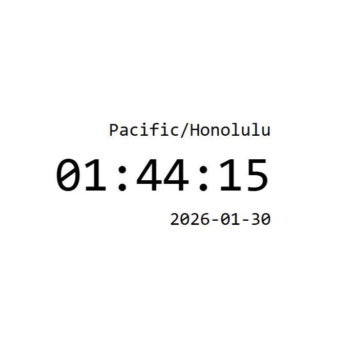

This project is a browser-based clock application that displays the current time and updates continuously using the day.js library. I built it using standard web technologies (HTML, CSS, and JavaScript) and integrated day.js to handle date and time formatting cleanly. Unlike working with raw Date objects, day.js provided a more intuitive API for parsing and formatting time, which made the implementation smoother and less error-prone.

In building this clock, I practiced manipulating the DOM directly and learned how to create a reliable update loop that refreshes the display every second without overwhelming the browser. I also gained experience balancing external library use with vanilla JavaScript, and day.js offered convenience without adding unnecessary complexity. This project strengthened my understanding of time-based applications and how they maintain synchronization between data and presentation in a user interface.

Repo: https://github.com/rystuckey/clock
